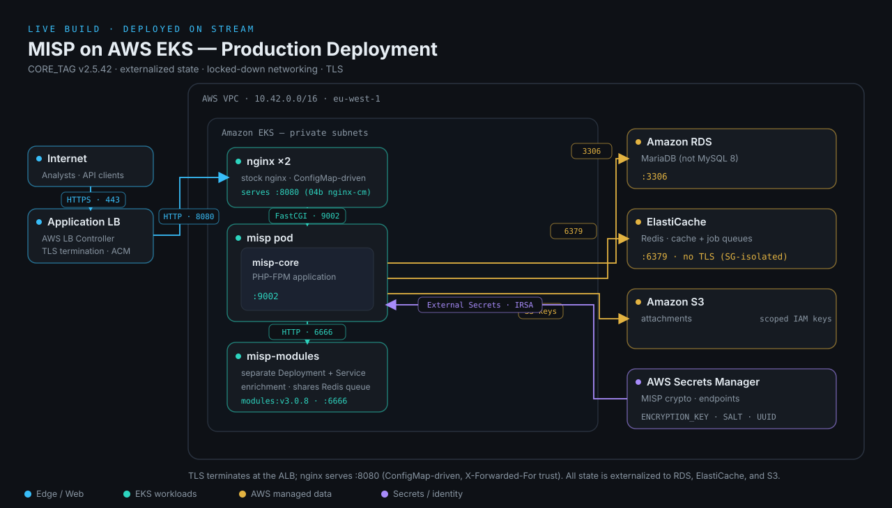

# MISP in Production on AWS EKS — Reproducible Runbook

Deploy a production-shaped MISP onto **AWS EKS** with **Terraform**, using the
**official `MISP/misp-docker` Kubernetes manifests** (adapted), with externalized
state (**RDS MariaDB**, **ElastiCache Redis**, **S3** attachments), behind an
**ALB + ACM TLS**, secrets from **AWS Secrets Manager** via **External Secrets** —
then harden it and validate the deployment end to end.

> **Branches:** `main` targets `CORE_TAG=v2.5.42` (current default) and its
> split-`misp-modules`/ConfigMap-driven-nginx manifests (see below). If you need
> the older, pre-refactor `v2.5.30`-era architecture (same-pod `misp-modules`
> sidecar, env-var-driven nginx entrypoint), use the
> [`legacy/misp-2.5.30`](https://github.com/kraven-security/livestreams/tree/legacy/misp-2.5.30)
> branch instead of overriding `CORE_TAG` on `main` — `main`'s `k8s/` manifests
> assume the newer architecture regardless of which `CORE_TAG` you point them at.

---

## What gets built



A production-shaped MISP: the web tier (nginx + php-fpm) and `misp-modules` run in
EKS as separate Deployments (as of `CORE_TAG>=v2.5.42` — `misp-modules` was
previously a same-pod sidecar), all state is externalized to AWS managed services
(RDS, ElastiCache, S3), secrets flow from Secrets Manager via External Secrets, and
the ALB terminates TLS with ACM. nginx runs the stock binary directly, configured
entirely by a ConfigMap (`04b-nginx-configmap.yaml`) rather than a custom
entrypoint script.

---

## Repo layout

```
misp-production/
├── README.md                     ← you are here
├── architecture.svg
├── docs/                         ← supporting runbooks
│   ├── acm-certificate-setup.md    ← issuing + DNS-validating the ACM cert via Cloudflare
│   ├── tool-installation.md       ← installing awscli, terraform, kubectl, helm, envsubst, jq
│   ├── aws-cli-configuration.md   ← authenticating the AWS CLI so Terraform/kubectl can use it
│   ├── dns-cutover-cloudflare.md  ← pointing MISP_HOSTNAME at the ALB via Cloudflare
│   ├── dns-cutover-route53.md     ← pointing MISP_HOSTNAME at the ALB via Route 53
│   ├── production-hardening-checklist.md   ← 53-point production-readiness walkthrough
│   └── production-hardening-checklist.html ← same checklist, self-contained branded page (open in a browser)
└── misp-eks/
    ├── Makefile                  ← `make up` / `make netpol` / `make down` — see Phase 1/2, Teardown
    ├── terraform/                ← EKS foundation (VPC, EKS, RDS, Redis, S3, secrets, addons)
    └── k8s/                      ← adapted MISP manifests (envsubst placeholders)
        ├── 00-namespace-rbac.yaml
        ├── 01-external-secrets.yaml
        ├── 02-services.yaml
        ├── 03-deployment-misp.yaml          ← from official deployment-misp.yaml
        ├── 03b-deployment-misp-modules.yaml ← misp-modules, its own Deployment as of CORE_TAG>=v2.5.42
        ├── 04-deployment-nginx.yaml         ← from official deployment-nginx.yaml
        ├── 04b-nginx-configmap.yaml         ← nginx.conf ConfigMap (CORE_TAG>=v2.5.42) — special envsubst, see Phase 2
        ├── 05-ingress.yaml
        └── 06-networkpolicy.yaml            ← apply LAST
```

> SIEM integration files (Filebeat / Elastic Agent configs, sync-user script,
> Indicator Match rule) live in the separate Elastic episode's repo, not here.

---

## Prerequisites

**Tools** (recent versions): `awscli` v2, `terraform` ≥ 1.6, `kubectl`, `helm`,
`envsubst` (from `gettext`), `jq`. An AWS account with admin-ish permissions and a
**registered domain / Route 53 hosted zone**. See
[`docs/tool-installation.md`](docs/tool-installation.md) for install steps for
each tool, and [`docs/aws-cli-configuration.md`](docs/aws-cli-configuration.md)
for authenticating the AWS CLI so Terraform (and later `kubectl`/`helm`) can use
it.

**OFF-AIR (do these before any live demo):**
1. **Issue + DNS-validate an ACM cert** for your MISP hostname in the cluster region.
   Validation is slow — never do it live. Note the cert ARN. If your domain is on
   Cloudflare, see [`docs/acm-certificate-setup.md`](docs/acm-certificate-setup.md)
   for the full request + DNS validation walkthrough.
2. Decide your hostname (e.g. `misp-lab.kravensecurity.com`). If your domain is on
   Cloudflare, keep it **single-level** — see
   [`docs/dns-cutover-cloudflare.md`](docs/dns-cutover-cloudflare.md) for why a
   nested hostname like `misp.lab.kravensecurity.com` breaks TLS at Cloudflare's
   edge before it ever reaches AWS.
3. Check service quotas: EIPs, NAT GW, ALBs, EKS nodes, ElastiCache nodes.
4. (Recommended) Stand up a **break-glass** copy: same Terraform, different
   `cluster_name` + state key, already applied and healthy.

**Rough monthly breakdown** (lab defaults, `eu-west-1`, running 24/7 — for
re-estimating in another region or size; on-demand list prices, excluding data
transfer/storage I/O):

| Component | Lab default | ~$/month |
|---|---|---|
| EKS control plane | 1 cluster | ~$73 |
| Worker nodes | 2× `m5.large` | ~$140 |
| NAT gateway | 1 (single-AZ) | ~$32 + data |
| RDS MariaDB | `db.t3.small`, single-AZ, 20 GB gp3 | ~$30 |
| ElastiCache Redis | 1× `cache.t3.small` | ~$25 |
| ALB | 1 | ~$20 + LCU |
| S3 + Secrets Manager | attachments + 2 secrets | ~$2 |
| **Total** | | **~$390–400** |

`production = true` raises this materially (second NAT, Multi-AZ RDS, 2-node Redis,
larger classes) — expect roughly 1.6–2×. The dominant lever is still *time*: destroy
between sessions.

> **Lab vs production is one switch.** Everything above is the `production = false`
> default. Set `production = true` in `terraform.tfvars` to flip the whole stack to a
> production shape in one place — one NAT gateway per AZ, Multi-AZ RDS, a 2-node Redis
> replication group with automatic failover, larger DB/cache classes, RDS deletion
> protection + final snapshot, and a longer Secrets Manager recovery window. Any
> individual sizing/HA variable you set explicitly still overrides the toggle, so you
> can mix (e.g. `production = true` but a smaller `db_instance_class`).

---

## Quick start (`make`)

Once `terraform.tfvars` is filled in and `AWS_PROFILE` is exported (see
Prerequisites above), the whole thing boils down to three commands from
`misp-eks/`:

| Command | What it does |
|---|---|
| `make up` | Terraform (VPC/EKS/RDS/ElastiCache/S3) **+** renders and applies the k8s manifests through the Ingress (Phases 1-2). Does **not** apply NetworkPolicies. |
| `make netpol` | Applies `06-networkpolicy.yaml` (Phase 4) — run only after confirming login + a feed pull work. Kept separate from `make up` on purpose: a misconfigured policy looks identical to a broken deployment, so you always want to be confirming health with policies off first. |
| `make down` | Full teardown: deletes the NetworkPolicy + namespace, then `terraform destroy`. Run this **between every demo session** — see the Cost warning above. |

Override defaults on the command line, e.g. `make up CORE_TAG=v2.5.42-RC1` to pin
a specific patch/RC of the current architecture. Variables: `NAMESPACE` (default
`misp`), `CORE_TAG` (default `v2.5.42`), `MODULES_TAG` (default `v3.0.8`). The VPC
CIDR is **not** a Make override — it's read from `terraform output vpc_cidr` (set it
via `vpc_cidr` in `terraform.tfvars`) so nginx's trusted-proxy range and the
NetworkPolicies can never drift from the real VPC. For the older `v2.5.30`-era
architecture
(same-pod `misp-modules`, env-var-driven nginx), switch to the
`legacy/misp-2.5.30` branch instead of just overriding `CORE_TAG` here — see the
Branches note above.

`make up`/`make netpol`/`make down` are just wrappers around the exact manual
steps in Phases 1-5 below — worth reading through once, especially the first
time, to understand what's actually happening at each step.

---

## Phase 1 — EKS foundation with Terraform

```bash
cd terraform
cp terraform.tfvars.example terraform.tfvars
# Edit terraform.tfvars: region, cluster_name, misp_hostname, acm_certificate_arn,
# admin_org, and production (false = cheap lab, true = production-shaped)

export AWS_PROFILE=misp-eks       # or whatever you configured — see docs/aws-cli-configuration.md
terraform init
terraform plan -out tfplan        # review off-air; save the plan
terraform apply tfplan            # ~15–20 min (EKS + RDS + Redis)
```

This creates: VPC (3 AZ) with a free S3 gateway endpoint (`vpc-endpoints.tf` —
keeps attachment/image-pull traffic off the NAT gateway's per-GB charge), EKS +
managed node group, AWS Load Balancer Controller, External Secrets Operator, the
EBS CSI driver addon (with its own IRSA role — `irsa-ebs-csi.tf`), RDS MariaDB,
ElastiCache Redis, S3 attachments bucket + scoped IAM keys, and the two
Secrets Manager secrets (with the AWS endpoints and generated MISP crypto
material baked in).

Point `kubectl` at the cluster and capture outputs:

```bash
eval "$(terraform output -raw configure_kubectl)"
kubectl get nodes                 # all Ready

export REGION="$(terraform output -raw region)"
export NAMESPACE="misp"
export MISP_HOSTNAME="$(terraform output -raw misp_hostname)"
export ACM_CERT_ARN="$(terraform output -raw acm_certificate_arn)"
export ESO_ROLE_ARN="$(terraform output -raw eso_irsa_role_arn)"
export VPC_CIDR="$(terraform output -raw vpc_cidr)"   # single source of truth — never hand-type this
export CORE_TAG="v2.5.42"         # pin; check github.com/MISP/misp-docker/blob/master/template.env for current
export MODULES_TAG="v3.0.8"       # keep paired with CORE_TAG per upstream's template.env
```

---

## Phase 2 — Deploy MISP on Kubernetes

The manifests use `${PLACEHOLDER}` tokens; render them with `envsubst` and apply in
order. **Hold the NetworkPolicies until the stack is healthy.**

```bash
cd ../k8s

render() { envsubst < "$1" | kubectl apply -f - ; }

render 00-namespace-rbac.yaml
render 01-external-secrets.yaml

# Confirm External Secrets actually materialized the k8s Secrets from AWS:
kubectl -n "$NAMESPACE" get externalsecret
kubectl -n "$NAMESPACE" get secret mysql-credentials instance-secrets

render 02-services.yaml
render 03-deployment-misp.yaml
render 03b-deployment-misp-modules.yaml   # misp-modules is its own Deployment as of v2.5.42

# 04b contains nginx's own $uri/$is_args/etc. placeholders. Plain envsubst (no
# shell-format list) blanks those out too, since they aren't real shell env vars —
# that corrupts nginx.conf silently, not loudly. Restrict substitution to just
# what we actually want, and apply it BEFORE the nginx Deployment so its
# ConfigMap mount doesn't stick in ContainerCreating waiting on a ConfigMap that
# doesn't exist yet:
envsubst '${NAMESPACE} ${VPC_CIDR}' < 04b-nginx-configmap.yaml | kubectl apply -f -
render 04-deployment-nginx.yaml
render 05-ingress.yaml

# Watch it converge
kubectl -n "$NAMESPACE" get pods -w
```

What to expect: the `misp` pod runs the k8s php-fpm entrypoint (DB schema applied
offline, permissions enforced, `configure_misp.sh` run), readiness goes green on
:9002 after ~15s+. `misp-modules` goes ready on :6666 (its own pod, reached by
`misp` at `MISP_MODULES_FQDN=http://misp-modules`). `misp-nginx` pods run stock
nginx on :8080 internally (the `misp-nginx` Service still exposes :80 externally
— nothing else needs to change). The Ingress provisions an ALB.

Get the ALB hostname:

```bash
kubectl -n "$NAMESPACE" get ingress misp \
  -o jsonpath='{.status.loadBalancer.ingress[0].hostname}'
```

---

## Phase 3 — DNS cutover + first login

Point `MISP_HOSTNAME` at the ALB — see
[`docs/dns-cutover-route53.md`](docs/dns-cutover-route53.md) for a Route 53 alias, or
[`docs/dns-cutover-cloudflare.md`](docs/dns-cutover-cloudflare.md) if your domain is
on Cloudflare instead. Then:

- Browse to `https://$MISP_HOSTNAME` — the ACM cert should be valid.
- Log in with `admin@$MISP_HOSTNAME` / the generated admin password:
  ```bash
  aws secretsmanager get-secret-value --secret-id misp/instance-secrets \
    --query SecretString --output text | jq -r .ADMIN_PASSWORD
  ```
- Change the admin password immediately.

If you get a redirect loop or CSRF error here, see **Troubleshooting → behind-ALB**.

---

## Phase 4 — Production hardening pass

This is the checklist applied. Walk these live. For the full production-readiness
walkthrough — MISP application settings plus infra hardening, marked by what this
stack already wires vs. what you configure — see
[`docs/production-hardening-checklist.md`](docs/production-hardening-checklist.md) (markdown) or [`docs/production-hardening-checklist.html`](docs/production-hardening-checklist.html) (html).

**Behind-ALB correctness (already wired):** on `CORE_TAG>=v2.5.42`, nginx serves
plain HTTP on :8080 only (no SSL redirect logic exists to disable) and trusts the
ALB's forwarded IP/scheme via `real_ip_header`/`set_real_ip_from ${VPC_CIDR}`
hand-added directly into `04b-nginx-configmap.yaml`'s `server` block — plus
`BASE_URL=https://$MISP_HOSTNAME` from `instance-secrets`. (On older tags, this
was the `DISABLE_SSL_REDIRECT`/`NGINX_X_FORWARDED_FOR`/`NGINX_SET_REAL_IP_FROM`
env vars instead.) Demo what breaks if you remove the ConfigMap's
`real_ip_header`/`set_real_ip_from` lines.

**Scaling the web tier (sessions/salt):**
- `misp-nginx` is a stateless proxy — already `replicas: 2`.
- `misp` (php-fpm) holds PHP sessions locally, so scaling it needs either ALB
  **sticky sessions** or shared sessions. The crypto material (`ENCRYPTION_KEY`,
  `SECURITY_SALT`, `MISP_UUID`, `ADMIN_ORG_UUID`) is **pinned in Secrets Manager**,
  so all replicas agree — this is the fix for "CSRF errors when I scale". To demo:
  ```bash
  kubectl -n "$NAMESPACE" scale deploy/misp --replicas=2
  ```
  Then show a session surviving across pods (with ALB stickiness on). Advanced
  option to explore on-air: Redis/DB-backed sessions via `PHP_SESSION_DEFAULTS`.

**Background jobs & cron (single owner):** workers run under supervisord per pod and
consume the **shared ElastiCache** queue. Scheduled pulls/pushes
(`CRON_PULLALL`/`CRON_PUSHALL`) must not double-fire across replicas — keep the
scheduled-task owner to one pod (or a dedicated single-replica worker deployment).

**Attachments on S3 (already wired):** `S3_ENABLE=true` + bucket/keys from
`instance-secrets`. Upload an attachment in the UI and confirm an object appears:
```bash
aws s3 ls "s3://$(cd ../terraform && terraform output -raw attachments_bucket)/"
```

**Backups (don't trust the repo's tar method):** RDS automated snapshots are on
(7-day retention). Take a manual snapshot to demo; back up the S3 bucket (versioned)
and the crypto material in Secrets Manager separately.

**Apply NetworkPolicies last:**
```bash
render 06-networkpolicy.yaml
# Re-test login + a feed pull afterwards to confirm nothing is wrongly blocked.
```
Or `make netpol` from `misp-eks/` — deliberately a separate command from
`make up`, not bundled into it, so you always confirm health first.

---

## Phase 5 — Validate the deployment

Prove production MISP actually works — not just that pods are green. This is the
episode's payoff.

**Background jobs / workers are alive:** Administration → Server Settings →
Diagnostics (or Workers). All queues (default, prio, email, cache, update) should
show running workers connected to the shared ElastiCache.

**Redis + DB connectivity:** the Diagnostics page should report the DB schema up to
date and Redis reachable. Confirm no config warnings.

**Attachment round-trip on S3:** create an event, add an attachment, then confirm the
object landed in the bucket:
```bash
aws s3 ls "s3://$(cd ../terraform && terraform output -raw attachments_bucket)/" --recursive | tail
```

**Feeds work (egress + jobs):** Sync Actions → Feeds → enable a default feed (e.g. a
CIRCL or Abuse.ch feed) → Fetch and store. A background job should run and events
should appear — this exercises internet egress, workers, and the DB together.

**API smoke test:** create an auth key (your admin user) and hit the REST API through
the ALB to confirm the public path + TLS + app all line up:
```bash
curl -s -H "Authorization: $MISP_AUTHKEY" -H "Accept: application/json" \
  "https://$MISP_HOSTNAME/servers/getVersion" | jq .
```

**HA sanity (optional):** with ALB stickiness on, scale `misp` to 2 and confirm a
logged-in session survives a request served by the other pod (thanks to the pinned
`ENCRYPTION_KEY` / `SECURITY_SALT`).

---

## Teardown

```bash
make down     # from misp-eks/ — wraps the steps below
```

Or manually, if you'd rather not use `make`:

```bash
# Remove k8s first so the ALB/ENIs are released before VPC destroy
kubectl delete -f <(envsubst < k8s/06-networkpolicy.yaml) || true
kubectl delete namespace "$NAMESPACE" || true

cd terraform
terraform destroy
```

If `destroy` hangs on the VPC, an ALB/ENI from the Ingress is usually still
present — confirm the namespace (and its Ingress) is fully deleted first.

---

## Troubleshooting (the gotchas, with fixes)

- **Redirect loop / CSRF behind ALB** → on `CORE_TAG>=v2.5.42`, confirm
  `04b-nginx-configmap.yaml`'s `server` block still has `real_ip_header
  X-Forwarded-For` / `set_real_ip_from ${VPC_CIDR}` (on older tags: the nginx
  container's `DISABLE_SSL_REDIRECT=true` / `NGINX_X_FORWARDED_FOR=true` /
  `NGINX_SET_REAL_IP_FROM=$VPC_CIDR` env vars), and `BASE_URL=https://$MISP_HOSTNAME`.
  Pin `ENCRYPTION_KEY`/`SECURITY_SALT` across replicas.
- **nginx `CrashLoopBackOff` with `host not found in upstream "misp-php"` / FastCGI
  cannot connect** → the php-fpm Service must be named exactly `misp-php` on 9002.
  On `CORE_TAG>=v2.5.42` this is hardcoded in our own `04b-nginx-configmap.yaml`
  (`fastcgi_pass misp-php:9002`); on older tags it was hardcoded in the official
  image's `/kubernetes/entrypoint_nginx.sh` instead. Either way it's not
  configurable via env var — verify the service name and that php-fpm is ready.
- **`misp-nginx` pods stuck `ContainerCreating` with `FailedMount ... configmap
  "nginx-conf" not found`, and/or `misp-modules` has no Deployment at all** →
  `CORE_TAG>=v2.5.42` needs two extra manifests applied (`03b-deployment-misp-
  modules.yaml`, `04b-nginx-configmap.yaml`) that older tags don't need — see
  Phase 2. `make up` already renders both; if you're applying manifests by hand,
  don't forget them, and apply `04b` **before** `04-deployment-nginx.yaml` so the
  ConfigMap exists before nginx tries to mount it. Fix if already stuck: apply the
  missing file(s) — kubelet retries the mount automatically once the ConfigMap
  exists, no pod restart needed.
- **MISP UI reports the wrong version (e.g. shows `v2.5.30` after you meant to
  deploy `v2.5.42`)** → the render used a stale `CORE_TAG`/`MODULES_TAG`. The classic
  cause is a **leftover `export CORE_TAG=…` (and/or `MODULES_TAG=…`) in the shell you
  ran `make up` from** — the Makefile now assigns these with `:=` so its own defaults
  win over the environment (and `make up` echoes the resolved tags at the start), but
  an exported value still leaks in if you drive the manual `envsubst` steps directly,
  and older checkouts used `?=` which let the environment win silently. Confirm what's
  exported (`echo "$CORE_TAG $MODULES_TAG"`) and `unset CORE_TAG MODULES_TAG` if
  they're stale. This can look like it "worked" (site loads fine, `HTTP 200`) because
  `04-deployment-nginx.yaml`'s `command`/`args` run the stock `nginx` binary directly
  regardless of image tag — a mismatched `CORE_TAG` doesn't break nginx, it just means
  `misp`/`misp-nginx` are running an unintended `misp-core` version. Check what's
  actually running with:
  `kubectl -n "$NAMESPACE" get pods -o jsonpath='{range .items[*]}{.metadata.name}{"\t"}{.spec.containers[*].image}{"\n"}{end}'`
  and re-`render` `03-deployment-misp.yaml`/`03b-deployment-misp-modules.yaml`/
  `04-deployment-nginx.yaml` with the correct tags exported to fix in place (triggers
  a rolling update, no data loss). If you actually *want* `v2.5.30`, don't just override `CORE_TAG` here —
  switch to the `legacy/misp-2.5.30` branch instead (see the Branches note up
  top), since `main`'s manifests assume the newer split-`misp-modules`/ConfigMap
  architecture regardless of the tag.
- **DB login error `3098 table does not comply ... external plugin`** → you're on
  MySQL 8, not MariaDB. This stack uses RDS **MariaDB** for that reason.
- **`misp` pod loops resetting to the same early init log lines every ~2.5 min,
  never gets past `configure_misp.sh`** → the liveness probe (60s delay + 4×15s)
  kills the container before first-boot DB schema apply / GnuPG keygen finishes —
  each restart resets progress. Fixed by the `startupProbe` in
  `03-deployment-misp.yaml` (up to 10 min grace before liveness/readiness kick in).
- **Firefox `SSL_ERROR_NO_CYPHER_OVERLAP` / curl `handshake failure` on
  `$MISP_HOSTNAME`, never reaches the ALB** → almost always a Cloudflare edge-cert
  gap, not this stack. See
  [`docs/dns-cutover-cloudflare.md`](docs/dns-cutover-cloudflare.md) — nested
  hostnames aren't covered by Cloudflare's free wildcard cert.
- **MISP workers crash-loop with `read error on connection to ... Redis->auth()`**
  → `misp-core` has no Redis TLS support at all (checked `v2.5.30` and `v2.5.42` —
  identical, TLS-less `/entrypoint.sh`), so it can't complete `AUTH` against an
  ElastiCache endpoint with transit encryption on. This stack runs ElastiCache
  *without* transit encryption/auth token for that reason (`elasticache.tf`) —
  relying on the security group (EKS node SG only) instead of a Redis password.
  If you re-enable transit encryption, you'll need a hand-rolled `stunnel` sidecar
  (`STUNNEL=true` / `STUNNEL_CONFIG=` env vars exist in the image, but there's no
  ready-made Redis-TLS config).
- **`ERR AUTH <password> called without any password configured`** → the image's
  `/entrypoint.sh` does `REDIS_PASSWORD=${REDIS_PASSWORD:-redispassword}`, and
  shell `:-` treats an *empty string* the same as unset — so `REDIS_PASSWORD=""`
  silently becomes the literal password `"redispassword"`, which a passwordless
  Redis then rejects. Set `ENABLE_REDIS_EMPTY_PASSWORD=true` on the `misp`
  container (already wired in `03-deployment-misp.yaml`) to skip `AUTH` entirely.
- **External Secret empty / k8s secret missing** → check the `external-secrets-misp`
  SA annotation (IRSA role ARN) and that the role can read both secret ARNs.
- **Image pull slow/stalls** → pre-pull `misp-core` onto nodes off-air; pin SHAs.
- **NetworkPolicy broke things** → you applied `06-` too early or CIDRs are wrong;
  delete it, get healthy, reapply with correct VPC CIDR.
- **`terraform apply` fails with "No valid credential sources found"** → `AWS_PROFILE`
  isn't exported in this shell. See
  [`docs/aws-cli-configuration.md`](docs/aws-cli-configuration.md).
- **`terraform apply`/`plan` fails with "Error acquiring the state lock"** → another
  apply is already running (check `ps aux | grep terraform`) — don't force-unlock;
  either wait for it or `Ctrl+C` it (releases the lock cleanly) before retrying.
- **`aws-ebs-csi-driver` addon stuck `CREATING` / controller pods `CrashLoopBackOff`
  with `ec2:DescribeAvailabilityZones ... UnauthorizedOperation`** → the addon has no
  `service_account_role_arn`, so the driver falls back to the bare node role, which
  can't call EC2. Fixed by the IRSA role in `irsa-ebs-csi.tf` wired into
  `eks.tf`'s `cluster_addons.aws-ebs-csi-driver`. If you change *any* addon's
  `service_account_role_arn` after its pods already exist, they won't pick up the new
  credentials until restarted — `kubectl -n kube-system rollout restart
  deployment/ebs-csi-controller` — since IRSA env vars/token are only injected at pod
  creation time.
- **Helm error "cannot re-use a name that is still in use"** → an earlier
  interrupted `terraform apply` left an orphaned Helm release in the cluster that
  Terraform's state doesn't know about (check `helm list -A --all` for a `failed`
  release). Clean it up with `helm -n <namespace> uninstall <release>`, then re-plan
  and apply.
- **`external-secrets` Helm release fails on a fresh `make up`/`terraform apply`
  with `failed calling webhook "mservice.elbv2.k8s.aws" ... no endpoints available
  for service "aws-load-balancer-webhook-service"`** → a startup race, not a real
  config problem: Terraform creates the `aws_load_balancer_controller` and
  `external_secrets` Helm releases from the same `eks_blueprints_addons` module
  call with no ordering between them (confirmed — the vendored module has no
  `depends_on` linking them), and the ALB controller's `helm_release` doesn't
  `wait` for its pods by default, so `external-secrets` can try to create its
  Service before the ALB controller's admission webhook is actually up to
  approve it. This is expected on **every** fresh cluster create now that
  destroy-between-sessions (`make down`/`make up`) is the default workflow — not
  a one-off. Fix: confirm the ALB controller is `Running` with webhook endpoints
  (`kubectl -n kube-system get pods -l app.kubernetes.io/name=aws-load-balancer-controller`,
  `kubectl -n kube-system get endpoints aws-load-balancer-webhook-service`), then
  `helm -n external-secrets uninstall external-secrets` and re-run
  `terraform apply` — by then the webhook is up and it succeeds immediately.

--- 

## License

Released under the [MIT License](LICENSE) — use it, adapt it, and run your own MISP
on it freely.
